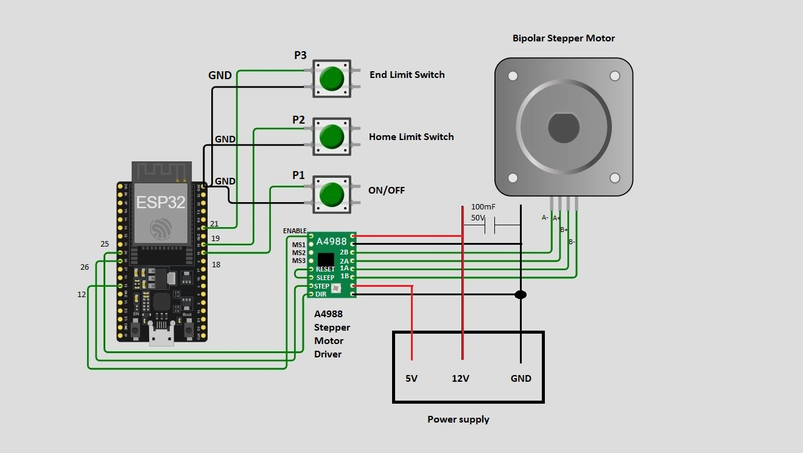

# Stepper Motor Driver (Wokwi Simulation)

This project demonstrates stepper motor control using an A4988 driver and Esp32 in the Wokwi simulator.

[Wokwi Project Link:](https://wokwi.com/projects/444588401819542529)

## ⚙️ Components Used
- ESP32
- A4988 Stepper Motor Driver  
- NEMA 17 Stepper Motor   
- Push Buttons (Start/Stop, Home limit, End limit)  

## 🧠 Functional Flow
1. Power / Start (P1 Button)
• Pressing P1 toggles between starting and stopping the motor.
• The motor resumes motion in the same direction it was rotating before it was
stopped, ensuring smooth continuation of operation.
• If homing has not been completed yet, the homing function is executed first.

2. Homing Sequence (P2 Button)
• During homing, the motor rotates toward the home limit switch (P2) until
the switch is pressed.
• After detecting the home switch (pressing P2), the motor moves slightly in the
opposite direction to back off.
• Then it moves slowly again toward the home switch (p2) for precise zero
positioning.
• Once P2 is pressed again, homing is complete, the motor’s position is
considered zero.
• The motor starts rotating clockwise towards P3.

3. Normal Operation
• When the end-limit switch (P3) is pressed, the motor reverses direction to
counter-clockwise.
• When the home-limit switch (P2) is pressed again, the motor reverses
direction back to clockwise.
• This creates continuous back-and-forth motion between the two limits.

4. Stop Operation
• Pressing P1 again stops the motor immediately.
• The current rotation direction is remembered, so when restarted, the motor
resumes motion in the same previous direction.

## 📸 Circuit Diagram

